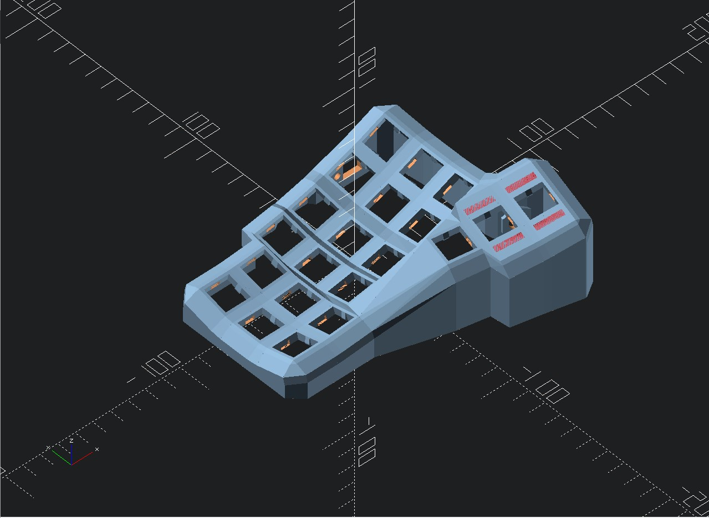

# Smaller-Dactyl

A small variant of the Dactyl keyboard.

## Assembly

---

### Generating Design

**Setting up the Clojure environment**

- [Install the Clojure runtime](https://clojure.org)
- [Install the Leiningen project manager](http://leiningen.org/)
- [Install OpenSCAD](http://www.openscad.org/)

**Generating the design**

- Open your terminal or command prompt
- Navigate to the _Case Files_ folder and run `lein auto generate`
- This will regenerate the `things/*.scad` files
- Use OpenSCAD to open a `.scad` file.
- When done, use OpenSCAD to export STL files

**Tips**

- [Some other ways to evaluate the clojure design file](http://stackoverflow.com/a/28213489)
- [Example designing with clojure](http://adereth.github.io/blog/2014/04/09/3d-printing-with-clojure/)

### Printing

Pregenerated STL files are available in the [things/](things/) directory.

### Wiring

col2row with diodes at the row with black line facing away from switch.
